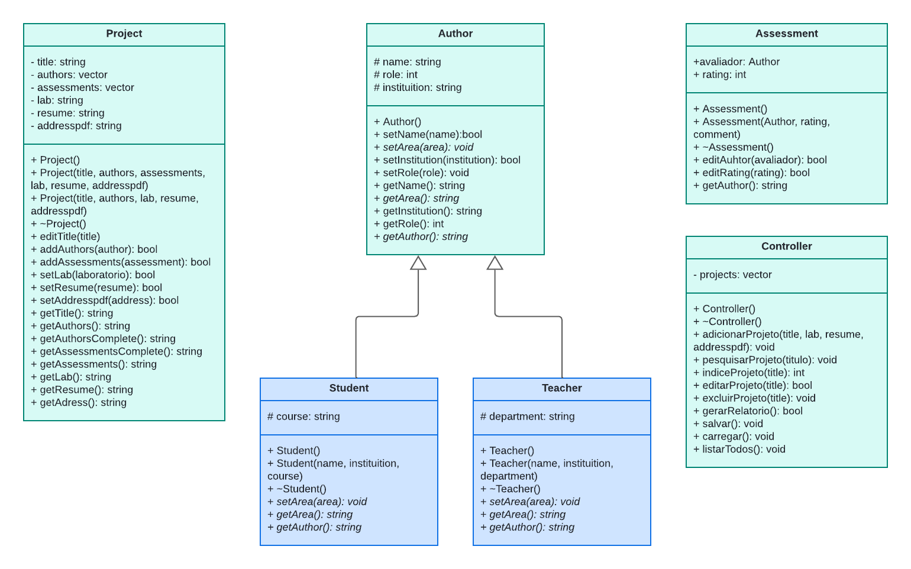

# Gerenciador de Artigos e Projetos Acadêmicos

## Descrição

Este software é um gerenciador de artigos e projetos acadêmicos desenvolvido em C++. Ele permite aos usuários organizar e acompanhar seus artigos, projetos e referências de forma eficiente. O programa oferece funcionalidades para adicionar, editar, excluir e buscar artigos, além de gerar relatórios.

## Funcionalidades Principais

- Adicionar novos artigos e projetos, com informações detalhadas como título, autor, resumo.
- Editar e atualizar informações de artigos existentes.
- Buscar artigos por título, autor ou palavra-chave.
- Gerar relatórios sobre os artigos e projetos cadastrados.
- Adicionar avaliações aos projetos publicados.

## Como Compilar e Executar

1. Clone o repositório do software para o seu computador.

2. Abra um terminal e navegue até o diretório do `Project`.

   ```
   g++ -c ./src/*.cpp
   g++ *.o test.cpp  
   ./a.exe
   ```


## Diagrama de Classes



## Colaboradores do Projeto

- Alysson Martim da S. Barbosa
- Fernanda Azevedo D. Silva
- Renan Abreu B. Freire